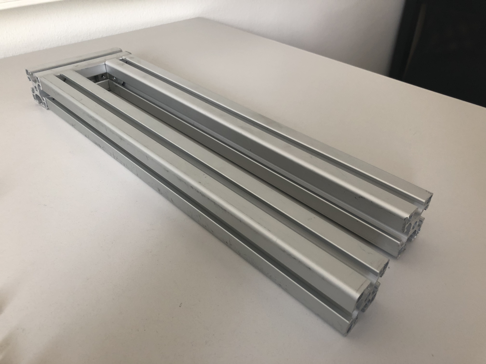

## Intro

Welcome to the webpage of supplementary material of our Siggraph 2018 project titled: **Perception Aware Modeling and Fabrication of Digital Drawing Tools**. On this pages you will find our collected friction and vibration measurements of drawing tools, as well as, a detailed assembly guide of our measurement setup. You can find more information and the full paper on our [project webpage](http://pdf.mmci.uni-saarland.de/projects/DigitalStylus/).

## Assembly Instructions

### Components

Here are the individual components that you will need:

* 2x Aluminum profile 40x40x1?? mm
* 1x Aluminum profile 40x40x2?? mm
* 2x ALuminum profile 40x40x3?? mm
* 1x Aluminum profile 40x40x4?? mm
* 1x Aluminum profile 40x40x5?? mm
* 1x Aluminum profile 10x40x6?? mm
* 3x Right angle joints for aluminum profiles
* 5x Right angle connectors for aluminum profiles
* 1x Adjustable angle joint for aluminum profiles
* 1x Pulley
* ??x Aluminum connectors with screws
* 1x ??M nut and bolt for the pulley
* 2x ??M nut and bolt for measurement arm
* 1x 1:131 DC motor: Pololu 131:1 Metal Gearmotor
* 1x Motor holder
* 1x Motor head mount
* 1x DC motor controller: Pololu Simple High-Power Motor Controller 18v25 
* 1x Hacked 12V AC->DC converter for the motor
* 8x Neudimum magnet
* 1x Arm protector
* Force sensor, we used OptoForce 10N
* 3D printed files and laser cut parts from our repository

### Step 1: Assembling the base

We start by connecting the two 40x40x1?? mm aluminum profiles with the 40x40x3?? mm aluminum profile using two right angle connectors. This will form a solid base to which we can attach other parts of the machine and will not shift during use.

### Step 2: Rising the mast

Next we use another two right angle connectors to attach the 40x40x2?? mm aluminum profile to the base as seen on the picture. We will later attach the pulley and mechanical arm to this mast.

### Step 3: Assembling the motor assembly

First, we need to make the motor holder connectible to our aluminum profile. To do this we drilled a simple hole. Next, we attch the holder to the 40x40x3?? mm aluminum profile using an aluminum connector. To prevent vibrations from the motor to the rest of the system we can attach a piece of rubber between the holder and the aluminum piece. Also to prevent shifting of the motor we added some zip-ties for extra strength. Finally, we attach the motor and a right angle joint to finish the motor assembly.

### Step 4: Attaching the motor assembly

Now we can attach the motor assembly. Remember to leave enough space for the rotating disc to move freely.

### Step 5: Adding auxiliary attachment arm

Now we can use a second right angle joint and attach the 40x40x4?? mm aluminum profile. This arm will be used to attach hand rest for user studies.

### Step 6: Adjustable hand rest

To make an adjustable hand rest we use the adjustable angle joint to connect the 40x40x5?? mm profile as seen on the pciture.

### Step 7: Attaching hand support

We attach the 10x40x6?? mm aluminum profile using the last right angle joint forming a base that can be used to rest a hand during experiments.

### Step 8: Making the handrest more comfortable

To make the handrast more comfortable we used double-sided duct tape to connect an arm protector with some padding to the base.

### Step 9: Making the pulley

We use the last right angle joint and thread it with the ?? M nut and bolt. We use another ?? M nut and bolt to connect the pulley to the other side of the joint.

### Step 10: Attaching the pulley

Now that the pulley is assembled we can connect it to the mast using an aluminum connector.

### Step 11: Assembling the turn table

We start by lasercutting and 3D printing our turntable design. We can connect these two designs using glue or double sided duct tape. The holes in the designs are meant to accomodate the neodimum magnets that we attach using double sided duct tape. Finally, we screw in the mothor head mount. We use similar procedure to assemble the top cover.

*note:* the magnets are a crucial piece of the setup as they allow for easy and quick replacement of measuring substrates. 

### Step 12: Attaching the turn table

Now we can simply attach the turn table to the motor assembly.

### Step 13: Assembling the arm

We thread the 3D printed arm with a ??M nut and bolt. The fit should be such that the arm can rotate freely without wiggle. To achieve this we use a stop bolt. Alternatively, you can use ballbearings to attach the arm.

### Step 14: Attaching the arm

Now we can simply attach the arm to the mast using an aluminum connector.

### Step 15: Vibration measurements

For vibration measurements we use the 3D printed holder attached directly to the mechanical arm. We use a piece of rubber to limit the vibrations of the machine to influance the measurement on the tool.

### Step 16: Friction measurements

For friction measurements we first attach the optoforce sensor and then attach the tool holder on a lever. This lever provides ~tenfold amplification of the tiny friction forces enabling us to use a relatively inexpensive force sensor.